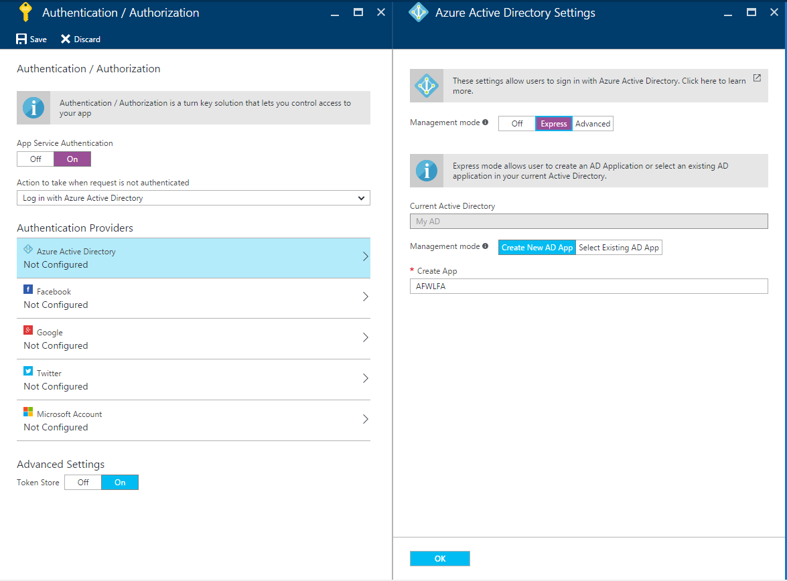
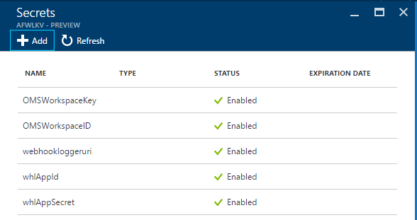
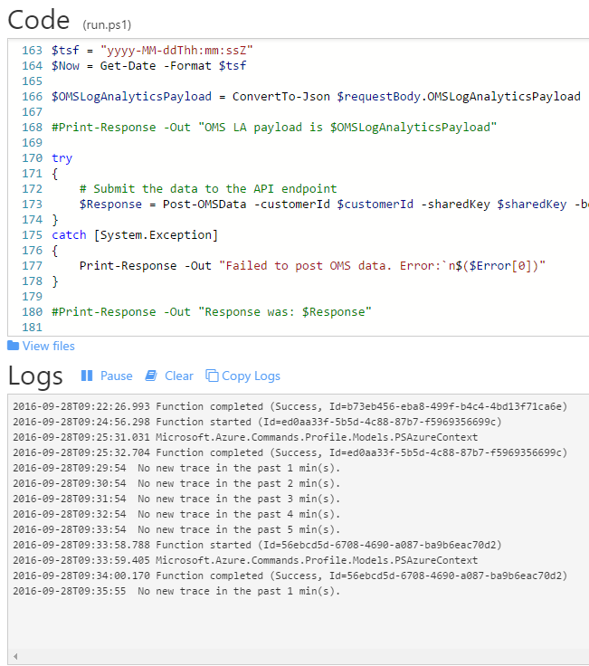

# Azure Functions Webhook Logger

Processes webhook calls and registers an event in OMS log analytics.

We use an Azure Automation Runbook to act as a relay to an Azure Functions App function. This function then connects to the [Log Analytics Data Collector API](https://azure.microsoft.com/en-us/documentation/articles/log-analytics-data-collector-api/).

- *What is the purpose of this?* Log Analytics (LA) is a great way to consolidate logging, and this is just one take on how to log webhook activity. Webhooks are basically an URL, and one that should be kept secret. If the webhook is from a runbook I would like more insight than what is provided currently for runbooks (they can be monitored by LA). We can see both spikes in activity, which over a longer period could indicate the webhook URL has been compromised. We can also gather data on the webhook payload.
- *Why not use Azure Automation all the way?* First of I wanted to try out Azure Functions, and second the runbooks are (still) so damn slow.
- *Why use runbooks at all?* I wanted to keep tokens, keys, etc. out of the source code. For this I utilize Azure Key Vault, but I needed authentication for this which Azure Automation provides with their run as account (service principal). To my knowledge there is no such thing in Azure Functions (yet).
- *Why split it up?* Reuseability of code. The code in Azure Functions could be used as an endpoint for various different "frontend APIs".

## Setup

Will need the following resources in Azure
- Resource Group
- Automation Account
- Key Vault
- Function App
 - App Service
 - App Service Plan (can use existing).
- OMS workspace

Other resources needed is a Github account.

### Github
Fork this repository and integrate it with the *Function App*. See [Hello Azure Functions - Integrating with Github](https://codebeaver.blogspot.dk/2016/09/hello-azure-functions-integrating-with.html) for help.

### Resource group

I recommend creating a new resource group for this purpose alone.

### Automation Account

Details on how to setup is found [here](./AzureAutomation/README.md).

### Key Vault

The Azure Automation service principal must be added to the *access policies* in the Key vault and have at least *get* in the *secret permissions*.
It is named `<automation account name>_guid`.

### Function App

This requires an *app service plan* which is the only resource that is ok reusing an existing one. If not, a free one (shared tier) is available which is fine for this purpose.
Integrate this with Github. You can fork this repository if you like, or copy/paste the stuff you need.
Save the function URL (webhook) to your key vault (as a secret), name it *webhookloggeruri*.

Now we need an AAD Application. I found a shortcut for this is to go to *Configure Authentication* then setting *App Service Authentication* to *On*. Select *Azure Active Directory*, then *Express* and change the app name if you like. Click *Ok* and remember to *Save*. Then turn it off again and save because we do not want to require authentication for this app.



Now go to the [Classic Portal](https://manage.windowsazure.com/). Select *Active Directory* and select the directory the app was created in. Go to Applications and select the app you just created.


Select *configure* and in the *keys* pane create a new key. Save this to the key vault along with the *client id*. Name them as follows:

- whlAppId
- whlAppSecret

And when you are in there give the newly created app *get* permission on secrets.

### OMS workspace

Create an OMS workspace. When deployed, go to the OMS portal. Go to *settings*, *connected sources* and copy the workspace ID and primary key to the key vault naming them as follows:

- OMSWorkspaceID
- OMSWorkspaceKey

The key vault secrets should now look like this



## host.json

When integrating an Azure Functions App with Github, this file tells it that we have a function in the folder *WebhookLogger*:

``
	"functions" : [
		"WebhookLogger"
	]
``

We also provide an ID which should be unique for production purposes, but for testing it does not really matter.

## Action!

The setup is done. In the runbook click the webhook tab and create a webhook. You can try it out with the following code:

```
$postParams = @{
    Text = "testing 123"
}

$WebhookURI = "https://s2events.azure-automation.net/webhooks?token=YOURTOKEN"

Invoke-WebRequest -Uri $WebhookURI -Method POST -Body ($postParams | ConvertTo-Json) -ContentType "application/json"
```

It may take 5-10 minutes before the data is searchable in OMS Log Analytics.

Note that the runbook is customized for Slack. This means that if you link a Slack channel to the runbook webhook it will extract some data from the payload and put into Log Analytics.

You should see the runbook complete with no errors, and the Azure Function App function to complete with no errors also.


